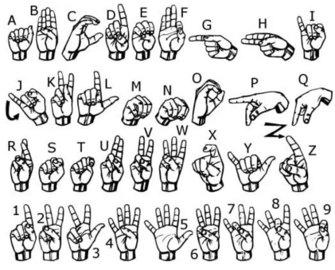

# Real-Time Sign Language Recognition

A simple real-time sign language recognition project that detects hand landmarks from a webcam and classifies static hand gestures for the 26 letters of the English alphabet. It uses MediaPipe Hands for landmark detection and a Random Forest model for classification [file:1].

## Overview

This project was built as a practical accessibility tool for recognizing static finger-spelling signs.  
Instead of using raw images, it extracts 21 hand landmarks and converts them into a 42-value feature vector for machine learning [file:1].

## Features

- Real-time webcam-based recognition [file:1].
- Recognition of the 26 letters A–Z [file:1].
- Hand landmark extraction with MediaPipe Hands [file:1].
- Random Forest classifier for fast prediction [file:1].
- Trained on a custom dataset collected with a camera [file:1].

## Project Structure

- `collect_imgs.py` – collects labeled images from the webcam [file:1].
- `create_dataset.py` – extracts hand landmarks and creates the dataset [file:1].
- `train_classifier.py` – trains the Random Forest model [file:1].
- `interference_classifier.py` – runs real-time recognition [file:1].

## How It Works

1. Capture hand gesture images for each letter.
2. Detect 21 hand landmarks using MediaPipe Hands.
3. Normalize the landmark coordinates.
4. Train a Random Forest classifier.
5. Use the trained model to predict the letter in real time [file:1].

## Dataset

- 26 classes.
- 200 images per class.
- 5,200 images in total [file:1].

## Alphabet Reference

Add the alphabet image here:

```md

```

## Results

The project reached about 99.9% accuracy on the test set, showing that landmark-based features can work very well for static sign recognition [file:1].

## Requirements

- Python
- OpenCV
- MediaPipe
- NumPy
- scikit-learn

## Notes

- The system uses only one detected hand at a time to avoid confusion [file:1].
- The project is designed for static gestures, not full continuous sign language [file:1].

## Author

Vlad-Andrei Paraschiv
